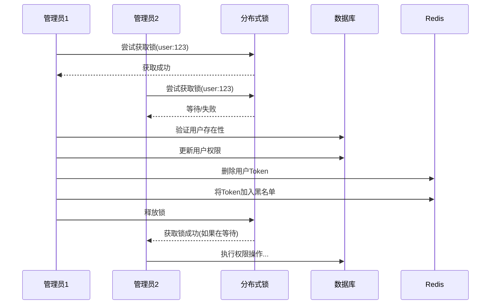

# 权限控制并发问题解决方案

## 问题分析

在多管理员并发操作的环境下，权限控制系统可能存在以下并发问题：

1. **权限修改竞态条件**：多个管理员同时修改同一用户权限
2. **权限验证不一致**：权限修改后Token中的权限信息可能过时
3. **权限升级漏洞**：并发操作可能导致权限验证绕过
4. **数据一致性问题**：权限修改过程中的数据不一致

## 解决方案

### 1. 权限管理服务

**实现类**：`PermissionServiceImpl`

**核心功能**：
- 统一的权限验证和管理
- 并发安全的权限修改操作
- 权限变更后的Token失效机制
- 完善的权限验证逻辑

### 2. 分布式锁保护

**使用场景**：权限修改操作

**锁策略**：
- 锁粒度：用户级别（`permission:change:{userId}`）
- 锁超时：10秒，防止死锁
- 操作原子性：确保权限修改的完整性

**实现效果**：
```java
// 同一用户的权限修改被串行化
String lockKey = PermissionConstants.PERMISSION_LOCK_PREFIX + targetUserId;
return distributedLockUtil.executeWithLock(lockKey, 10L, TimeUnit.SECONDS, 
    () -> executePermissionChange(targetUserId, newPermission));
```

### 3. 权限变更后的Token管理

**问题**：权限修改后，用户的Token中仍包含旧的权限信息

**解决方案**：
- 权限修改成功后立即使Token失效
- 将Token加入黑名单
- 删除Redis中的Token记录
- 强制用户重新登录获取新权限

**代码实现**：
```java
// 权限修改成功后处理Token
invalidateUserTokenOnPermissionChange(targetUserId, reason);
```

### 4. 权限验证增强

**安全检查**：
- 操作者权限验证（必须是管理员）
- 自我修改权限防护（管理员不能修改自己的权限）
- 参数合法性验证
- 目标用户存在性检查

**验证流程**：
```
1. 检查操作者是否为管理员
2. 防止自我权限修改
3. 验证权限值合法性（0或1）
4. 检查目标用户存在性
5. 执行权限修改
6. 使Token失效
```

### 5. 统一的权限常量管理

**实现类**：`PermissionConstants`

**目的**：
- 集中管理权限相关常量
- 统一错误消息
- 提高代码可维护性

## 并发控制流程



## 安全特性

1. **防重入攻击**：使用分布式锁防止并发修改
2. **权限升级防护**：严格的操作者权限验证
3. **会话一致性**：权限变更后强制重新认证
4. **审计追踪**：完整的操作日志记录

## Redis键设计

```
permission:change:{userId}     # 权限修改锁
user:token:{username}:token    # 用户Token
blacklist:{token}              # 失效Token黑名单
```

## 性能优化

1. **细粒度锁**：用户级别的锁，不影响其他用户的权限操作
2. **短锁时间**：10秒锁超时，减少等待时间
3. **异步处理**：非关键操作可以异步处理
4. **缓存机制**：权限验证结果可以适当缓存

## 扩展性

该方案为后续的细粒度权限控制打下基础：
- 支持角色权限体系扩展
- 支持资源级别权限控制
- 支持权限继承和委派机制